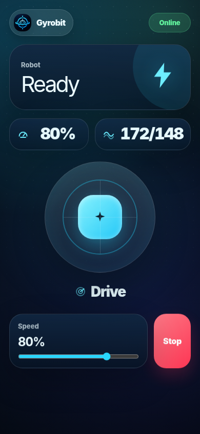
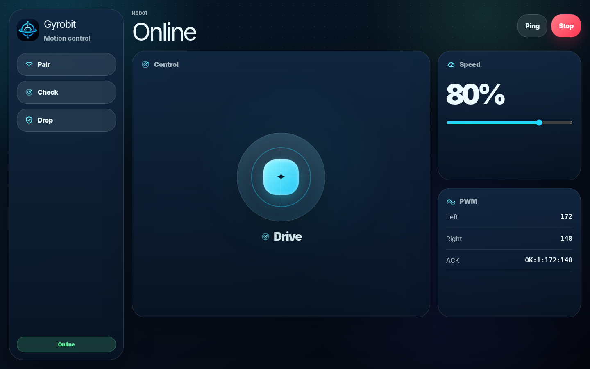

# Robotic Ball

An open-source robotic ball platform.

---

## Overview

Robotic Ball is a compact robotics platform that integrates custom mechanical design, embedded electronics, firmware, and a mobile application.

The project was developed as a multidisciplinary engineering project involving:

* Mobile Application Development
* Mechanical Design
* PCB Design
* Embedded Programming

---

## Assembly Animation

---

## Control UI

---

### Final Assembly

 
 

---
## Assembly tips

Parts such as the cap and motor holder should be glued together using adhesive.

To charge the batteries, the 2S BMS should be externally attached to the main body.

then be Happy

---

## License

This project is released under the MIT License.

See the LICENSE file for details.
