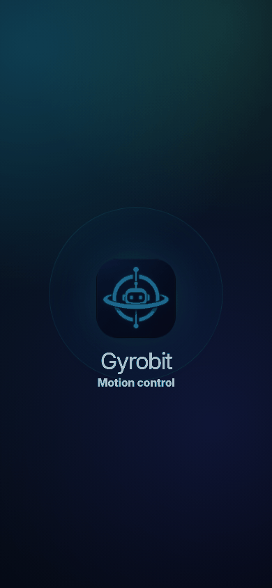
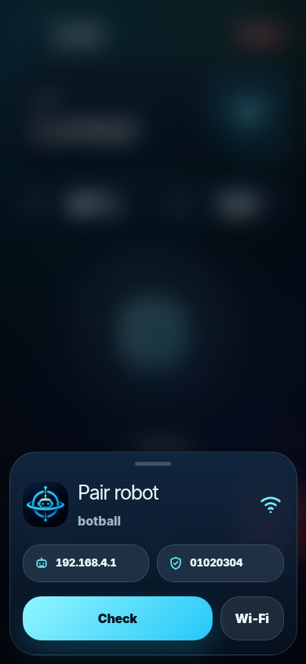
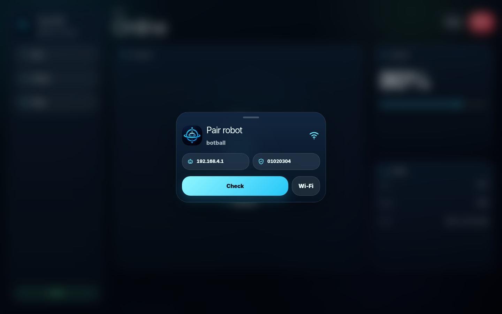

# Gyrobit

Minimal Tauri robot controller for ESP8266 SoftAP robots.

## Preview

### Motion



### Pair sheet





### Control UI


## Run

```bash
npm install
npm run tauri:dev
```

## Build

```bash
npm run build
npm run tauri:build
```

## Robot link

```txt
SSID: botball
PASS: 01020304
UDP: 192.168.4.1:4210
Payload: J,throttle,steer,speedLimit
ACK: OK:cmd:leftPwm:rightPwm
```

## Features
- Mobile: splash, pair sheet, rounded joystick control.
- Desktop: left panel, dashboard, telemetry cards.
- Wi‑Fi is user-managed; app checks robot by UDP ACK.
- Control payload: `J,throttle,steer,speedLimit`.
- Locked controls until ACK; emergency stop sends stop.
- Firmware: PWM speed, soft turns, failsafe, ACK.

